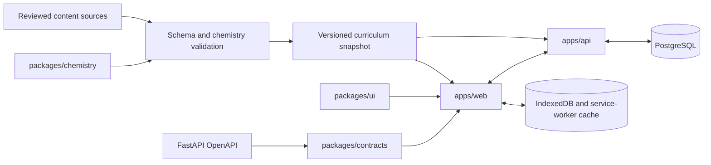

# Current architecture

## Status and scope

This document describes the accepted target architecture for the first implementation. ADRs in `docs/decisions/` explain why major choices were made and take precedence if this summary becomes stale.

## Repository layout

```text
apps/
  web/                 Next.js App Router application and PWA
  api/                 FastAPI HTTP API and persistence orchestration
packages/
  chemistry/           Pure TypeScript chemistry and answer-evaluation domain
  contracts/           OpenAPI-generated TypeScript client and contract artifacts
  ui/                  Reusable accessible React presentation primitives
content/               Reviewed authoring sources and generated curriculum snapshots
docs/                  Product, architecture, contracts, security, and plans
```

The JavaScript/TypeScript workspace uses pnpm. Python dependencies and commands use `uv` with a committed lockfile for `apps/api`.

## Components and dependencies



Allowed dependency direction:

- `apps/web` may depend on `packages/ui`, `packages/contracts`, `packages/chemistry`, and generated reviewed content.
- `apps/api` depends on its own application/domain interfaces and persistence adapters. It publishes OpenAPI but does not import frontend packages.
- `packages/chemistry` depends on neither application and has no I/O.
- `packages/contracts` is generated from OpenAPI; application code does not hand-edit generated files.
- `content` contains data and authoring metadata, not runtime application logic.

Circular dependencies and imports between `apps/web` and `apps/api` are forbidden.

## Runtime data flow

### Curriculum and grading

1. Authors edit structured records under `content/` with sources and review metadata.
2. Validation checks schema, IDs, references, formula parsing, equation balance, aliases, and review status.
3. The build emits a versioned runtime snapshot containing only reviewed, non-deprecated records.
4. The PWA caches that snapshot for offline use.
5. Exercise selection and answer evaluation execute locally through pure `packages/chemistry` functions.

The API may distribute the same snapshot and record progress, but it is not the sole source of curriculum. The server does not maintain a separate chemistry implementation.

### Progress and synchronization

1. A completed answer creates an immutable local attempt event with a stable client event ID, content version, round, learning mode, answer direction, and match policy. The browser store validates every event against one Zod schema that lists the allowed mode, direction, and match-policy combinations: an invalid event is rejected when written and skipped when read.
2. The UI updates local session state and derived mastery immediately, even while offline.
3. When authenticated and online, a sync worker sends pending events through the generated client.
4. The API enforces identity, ownership, schema, idempotency, and ordering, then persists accepted events in PostgreSQL.
5. A successful acknowledgement removes the event from the pending queue. Retryable failure keeps it queued; permanent rejection is visible and recoverable.

The application does not use last-write-wins for immutable attempt events. User preferences that can conflict need an explicit version or updated timestamp and a documented resolution rule.

## Rendering and state ownership

- Next.js Server Components provide route shells and online server-rendered content where useful.
- Core exercise interactions are small Client Component islands because they require browser state, input, IndexedDB, and offline operation.
- TanStack Query owns remote server state in Client Components.
- IndexedDB owns cached curriculum, local attempts, pending synchronization, and spaced-repetition records.
- The initial `Prvky` flashcard route reads reviewed element and named-group records from `@inorganic/content/runtime`. Locally edited or user-added cards are stored separately in IndexedDB and overlay the reviewed records only in that browser; they never mutate authored curriculum.
- `localStorage` is limited to small, non-sensitive startup preferences.
- React component state owns transient UI state that need not survive navigation.

Do not mirror one category into another without a specific synchronization contract.

## Offline and update model

Core learning routes, required assets, the application shell, and a reviewed curriculum snapshot are precached or made available through an explicit runtime policy. Authenticated API responses are not placed in a shared service-worker cache.

Every persisted database and browser-store format has a schema version. The application migrates compatible data transactionally. If migration cannot be safe, it offers an explicit export/reset or recoverable reset path instead of failing to render.

Application and curriculum versions are independent. A new application may read declared older curriculum versions; unsupported combinations show a clear update/recovery state.

## Deployment model

- The web application and API deploy independently but share a compatibility-tested HTTP contract.
- PostgreSQL is private to the API.
- Database schema changes use Alembic and support rolling application deployment where possible.
- Static/runtime curriculum artifacts are content-addressed or versioned so service-worker updates cannot combine incompatible files silently.
- Configuration comes from validated environment variables; secrets are injected by the deployment platform.

## Future change rules

Changes to frameworks, database/ORM, API style, authentication architecture, offline persistence, or the canonical chemistry runtime require an ADR. Update this document in the same change once an ADR is accepted.
